# 📚 Exploring the AWS Bedrock Knowledge Bases. 
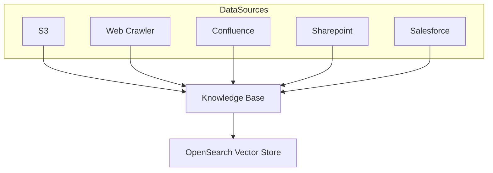
# 💡Combined OpenSearch Vector Store, save money
As the OpenSearch Vector Store is the costly component of the architecture. I created a combined OpenSearch Vector Store 
at the time of retrieval we pass in filters so we can retrieve only the relevant data. This way we can reduce the cost of
the OpenSearch Vector Store. When you create a OpenSearch Vector Store it reserves the resources, and you can not turn it off.
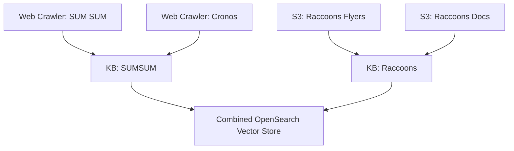

# 📁 Project structure
```
.
├── app.py  # Streamlit app
├── config.py  
├── create_url.py  # tool to create access url for knowledge base
├── private_key.pem  # create your own private key
├── public_key.pem  # with a match public key
├── README.md
├── requirements.txt
└── utils.py  # helper functions
```
# ⚙️ EC2 Initial Setup
Set up an EC2 instance with ubuntu and with a public static ip and assign a role that allows all required permissions.
```json
{
    "Version": "2012-10-17",
    "Statement": [
        {
            "Effect": "Allow",
            "Action": [
                "bedrock:ListDataSources",
                "bedrock:RetrieveAndGenerate",
                "bedrock:Retrieve",
                "bedrock:InvokeModel",
                "bedrock:InvokeModel",
                "bedrock:GetKnowledgeBase"
            ],
            "Resource": "*"
        }
    ]
}
```
## Clone the repository
```bash
git clone https://github.com/GerritGeeraerts/aws-kb-demo
cd ./aws-kb-demo
```
## Creating public and private key for secure access links
The commands below create private_key.pem and public_key.pem. The public key is used to encrypt the access links.
When you want to create an url on your local machine (with create_url.py) make sure you copied the same keys from the 
server to your local machine.
```bash
openssl genpkey -algorithm RSA -out private_key.pem -pkeyopt rsa_keygen_bits:768
openssl rsa -pubout -in private_key.pem -out public_key.pem
```
## Create virtual environment
```bash
python3 -m venv .venv
source .venv/bin/activate
pip install -r requirements.txt
```
## Manually test the project
```bash
streamlit run app.py
```
## 🔄 Automatically start app on startup
### Create the service file
```bash
sudo nano /etc/systemd/system/streamlit-app.service
```
Copy the code below and paste it in the file, make sure to replace the placeholders:
* Replace ***USERNAME*** with your username (use `whoami` to get your username)
* Replace ***PATH_TO_YOUR_PROJECT***
* Replace ***PATH_TO_YOUR_VENV***
```ini
[Unit]
Description=Streamlit App Server

[Service]
User=***USERNAME***
WorkingDirectory=/***PATH_TO_YOUR_PROJECT***
ExecStart=/***PATH_TO_YOUR_VENV***/bin/streamlit run app.py
Restart=always

[Install]
WantedBy=multi-user.target
```
### Enable the service
```bash
sudo systemctl enable streamlit-app.service
```
### Start the service
```bash
sudo systemctl start streamlit-app.service
```
### Verify the service
```bash
sudo systemctl status streamlit-app.service
```
# 🌐 EC2 after initial setup
To save resources you can turn the EC2 off and on and copy the public ip.
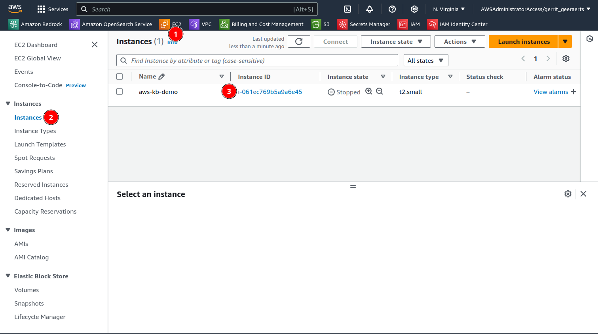
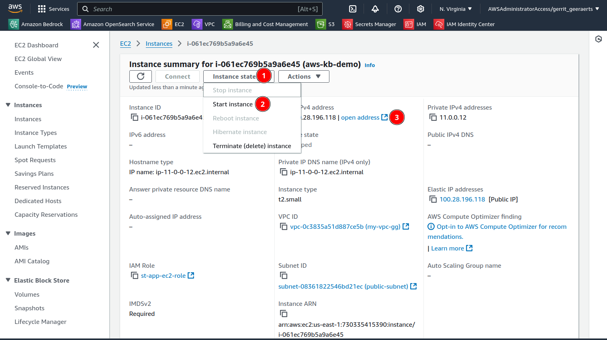
# Bedrock setup
## Create knowledge base
1. Create a knowledge base:
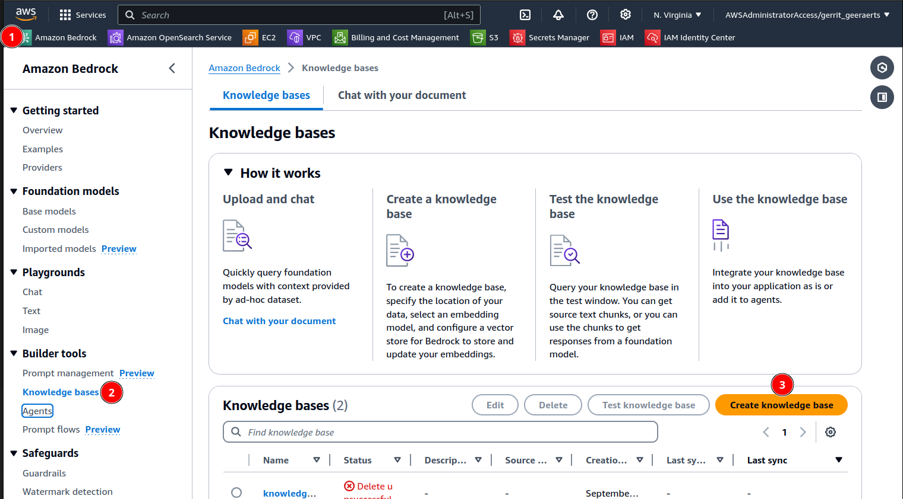
2. Choose S3 or Web Crawler as data source:

3. Choose webcrawler as data source and select default sync scope
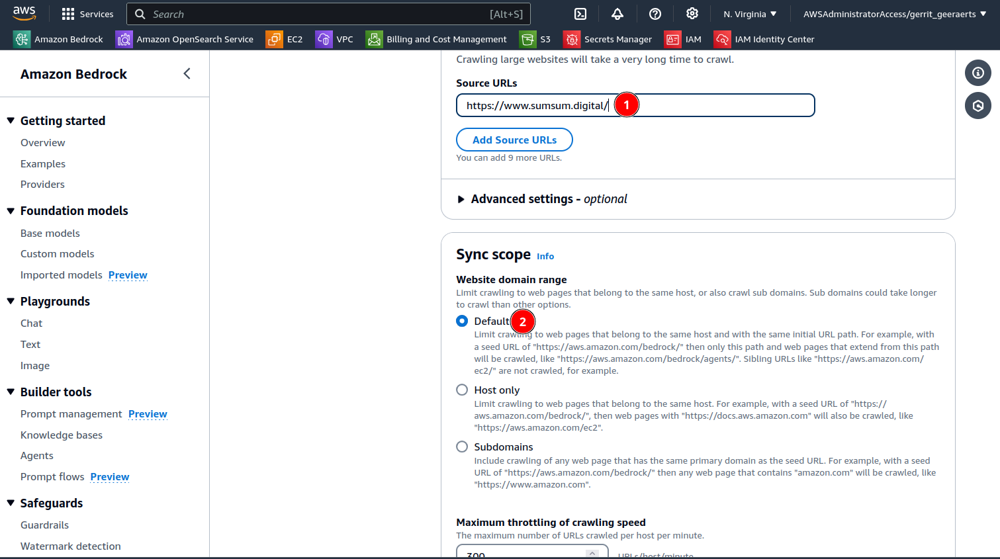
4. Select custom chunking and set to hierarchical chunking
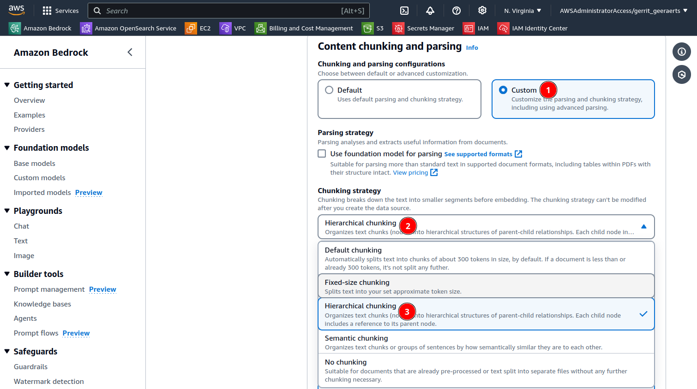
5. Choose titan embeddings V2, is required for larger text chunks
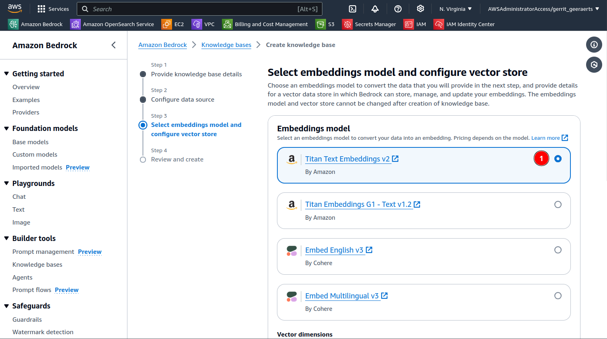
6. If it is the first KB select quick create a new vector store, **otherwise select an existing vector store and copy 
the vector database config from an existing vector store. (Look at step 9)**
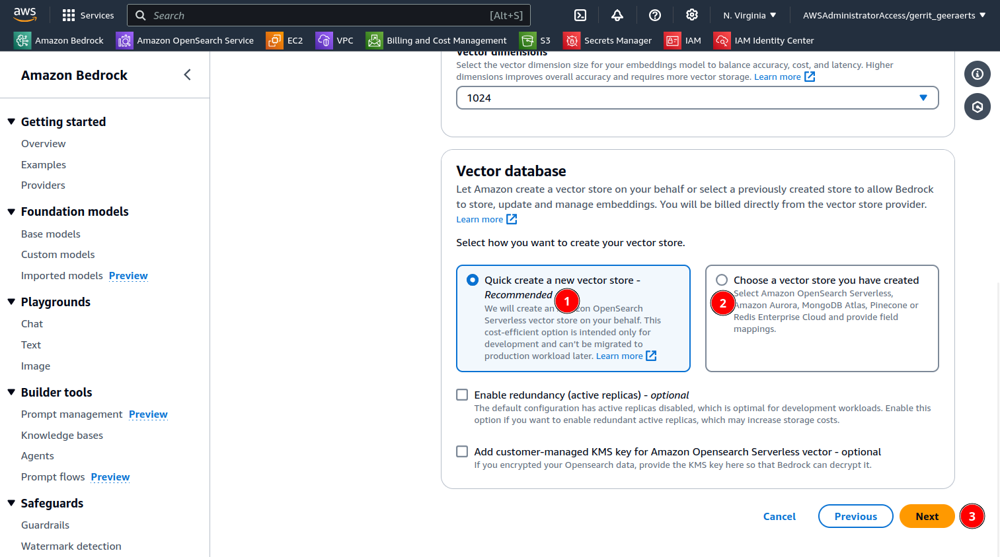
7. Select the created data source and click sync, you can also click add data source so you can add an extra 
webcrawler or s3 bucket:
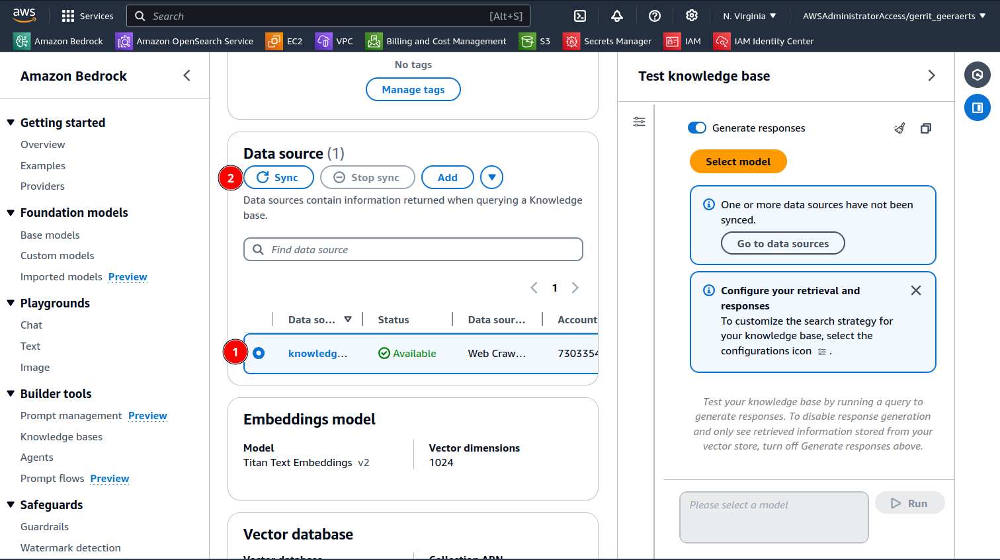
8. Copy the knowledge base id, you will need this to create the access url. 
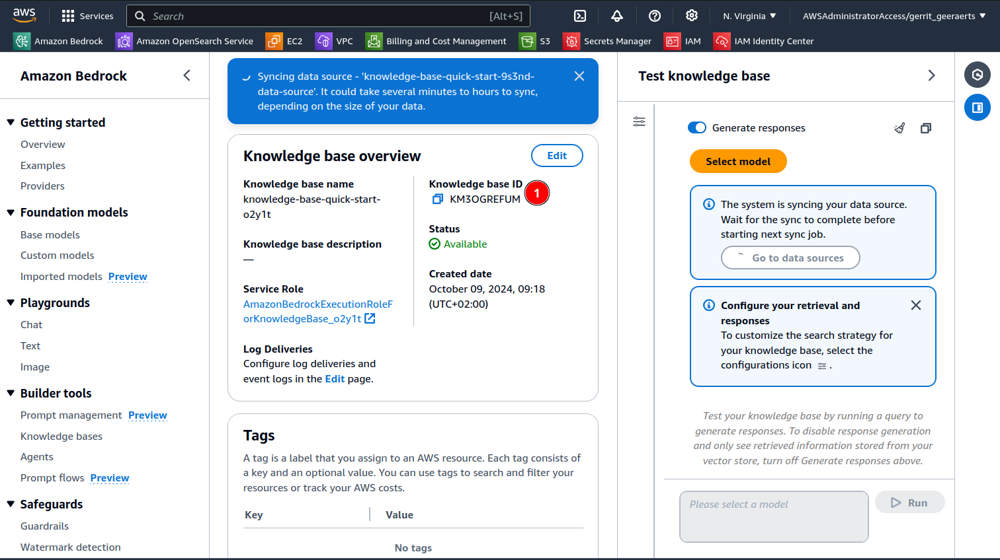
9. When creating a second knowledge base, look at an existing KB and copy the vector database info to the one you are 
creating.
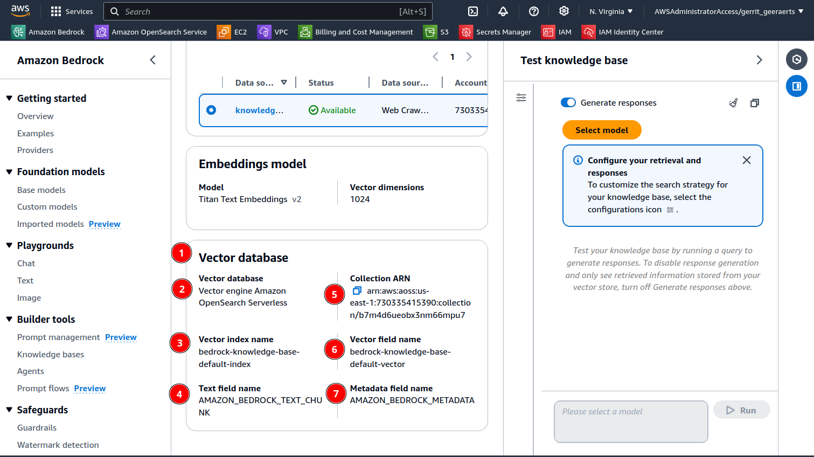
## Create access url for knowledge base
The app can talk with different AWS Bedrock Knowledge Bases. To talk to a specific knowledge base, you need to create 
an encrypted URL. You can do this with the `create_url.py` script. The encrypted url serves as a 
you-have-access-if-you-have-the-url. So you can easily share secure urls without managing logins.
Run the script and provide the knowledge base id when prompted. If you are creating an access url. 
Make sure you have the same public and private key from the ec2 server on your local machine.
```bash
python create_url.py
```
The script will output an encrypted URL that serves as you can only access the demo if you have the url. Make sure to 
replace `localhost` with the public ip of your ec2.
# 💵 Delete the knowledge base and Vector Store, to save costs
> **Warning** Vector store database is the 💵 costly component of the architecture. When you do not need it delete it.

> **Note** the vector store contains all the data from all the knowledge bases attached to it.
1. Go to the knowledge base you want to delete and delete the KB
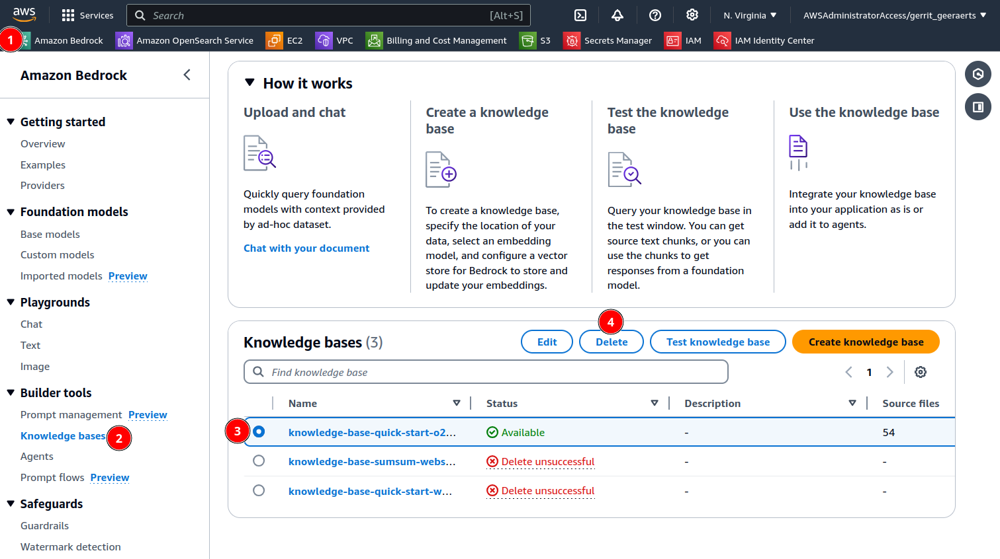
2. Go to the vector store and delete the vector store
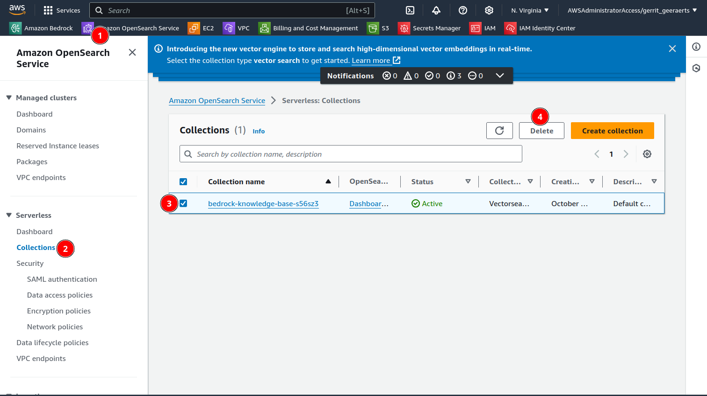

